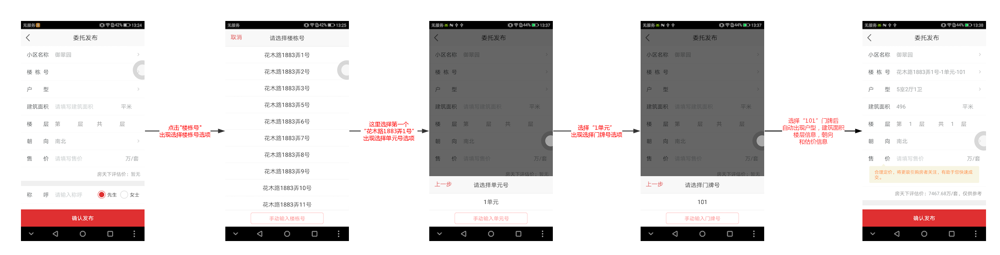
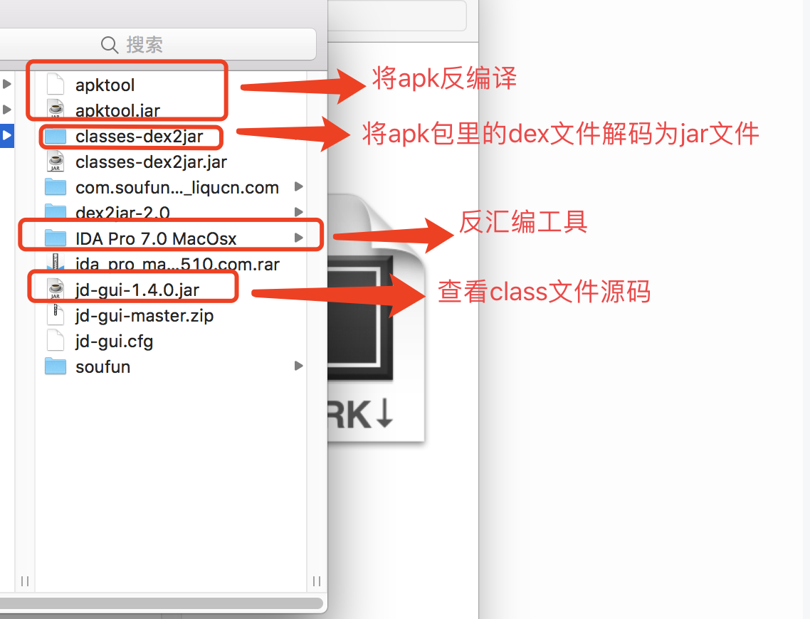
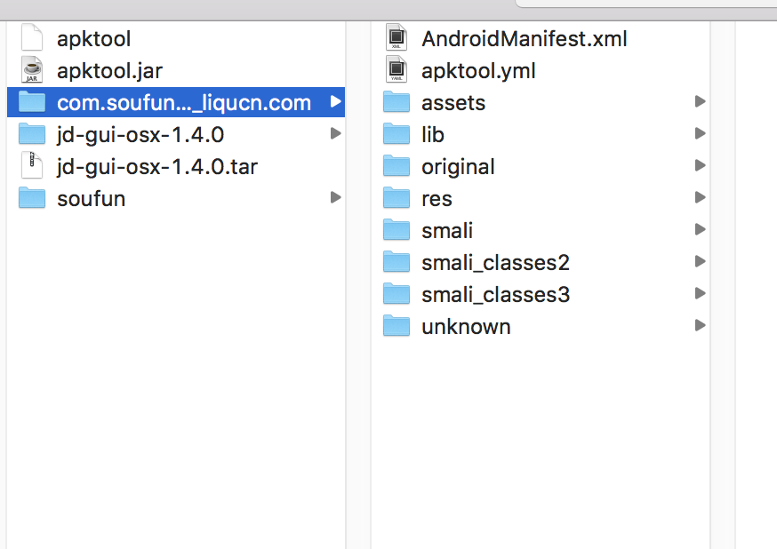
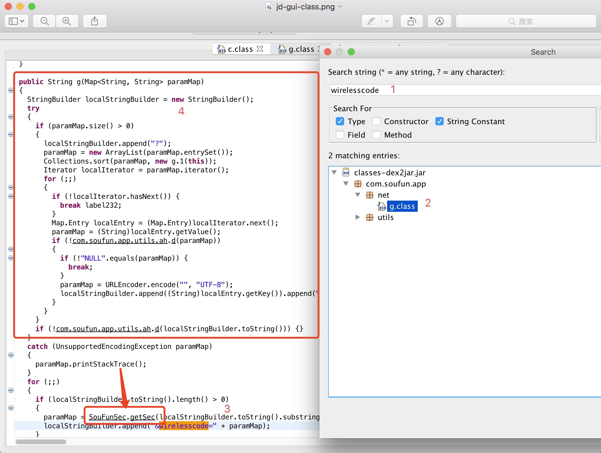
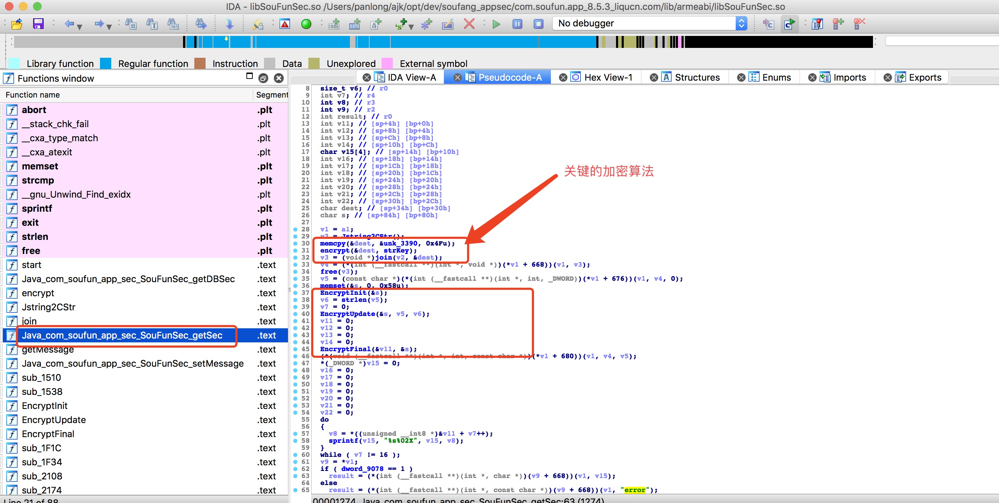

### 搜房网app加密数据获取过程
-  项目背景
    - 有用的数据：搜房app首页有个`我要卖房`的功能，点进去后选择`我要卖房`，选择完小区后，单元号和楼栋号自动出现，只需点击选择即可，无需手动输入。
    - 功能图解：
        - 点击首页`我要卖房`，然后在该页面选择`我要卖房`按钮，进入后点击小区输入小区或者直接选择小区，下图表示了这个流程：
            - 
    - 初步分析：搜房后端有大数据支撑，而且是花了大手笔做的这个事。搞过来为我司所有，必定有用。拿来主义嘛。
    - 项目目标：将这块的大数据抓取下来。
- 业务功能
    - 现状：只能从app中看到此功能，从charles截包分析
    - 本次设计的功能
        - 从app上来看，很难看出具体的实现方式，几番思考，得出如下的步骤
            1. charles抓取api分析
            2. 分析参数格式
            3. 将分析结果规律形成文档，根据文档编写爬虫脚本
            4. 执行脚本，抓取数据
    - 可能出现的难点
        - 参数加密过，无法得知加密方法，进而止步于此
        - app签名规则复杂，如果走apk破解的方案，则签名规则是是首先要解决的问题
- 人员安排
    - 潘龙(预研),谢建超(预研)
- 详细设计
    - 从网页版入手
        - 看到app这个功能，立马去touch网页看了下，同样看到此页面，因为touch上抓取数据就简单多了，然而点进去后，输入小区名称后，还是需要手动输入
        - 估计搜房的这个功能只有在app下才有，因为app里的签名增强了安全性
        - 搜房既然这么做，那说明这块功能是他们重点保护过的，难度上较高
    - 思路
        - 找规律：遇到这种问题，首先想的是大概有几种思路，而不是立马去做，首先是截包
            - 截包得到的链接如下
                - 点击选择 “楼栋号”，楼栋号url: http://soufunappesf.3g.fang.com/http/sf2014.jsp?city=%E4%B8%8A%E6%B5%B7&messagename=GetDelegateTips&newcode=1210063040&type=8&wirelesscode=DF87A14EACA93042481B0E0721DB4808
                - 选择楼栋号后，点击选择“单元号”，单元号url: http://soufunappesf.3g.fang.com/http/sf2014.jsp?city=%E4%B8%8A%E6%B5%B7&dongid=311019&messagename=GetDelegateTips&newcode=1210063040&type=4&wirelesscode=9EC0C44CA7F79587016C4AEBAF940080
                - 选择单元号后，点击选择“门牌号”，选择完，呈现页面
                - 户型url: http://soufunappesf.3g.fang.com/http/sf2014.jsp?city=%E4%B8%8A%E6%B5%B7&messagename=GetDelegateTips&newcode=1210063040&roomid=8377336&type=3&wirelesscode=696C8DEBE372619066C61F6F15864408
                - 楼层url: http://soufunappesf.3g.fang.com/http/sf2014.jsp?city=%E4%B8%8A%E6%B5%B7&danyuan=1&dongid=311019&messagename=GetDelegateTips&newcode=1210063040&type=2&wirelesscode=1E5FD3D03D975D87450579152244D3E0
        - 我从charles捕获的url和呈现的结果，总结出几点
            1. url加密是`针对querystring的加密`，很像是md5，不清楚是否加了salt值（凭经验是100%加了，就是不知道有没有其他加密方式）
            2. 断定加密串中没有`时间验证`因为同一个url，可以无限重发
            3. url中参数不带设备号，可以从apk里的代码入手
            4. 从模拟app行为入手
        - 计划
            - plan a：破解apk，能直接调用接口，从而做个自动化抓取数据。 难度：🌟🌟🌟 
            - plan b：破解签名规则，根本上解决，这样所有搜房的数据都能呈现在眼前。 难度：🌟🌟🌟🌟🌟
            - plan c：自己装个android studio，自己研究下动态链接库在android下是怎么运作的。难度：🌟🌟🌟🌟
            - plan d：使用类似“按键精灵”的工具，模拟点击，然后拦截数据。 难度：🌟🌟🌟🌟
    - 实操
        - 几个计划，除了按键精灵在ubuntu下找不到工具，其他的都试过，现只将整个正常流程的文档设计梳理如下，就不将走的弯路细说了。
        - 工具下载，如图所示：
            - 
            - 首先确保java环境，不要java9版本
            - java9版本的解决方案
                - 查看当前java有哪些版本 /usr/libexec/java_home
                - 根据上个步骤，配置环境变量如下
                - 
            - mac上dex2jar下载比较简单
                - ```brew install dex2jar```
        - 步骤
            1. apktool工具解包
                - 命令： ```java -jar decode soufun/apktool com.soufun.app_8.5.3_liqucn.com.apk```
                - 执行完得到如下图文件夹
                - 
            2. 将apk扩展名改名为zip，提取里面的 ```classes.dex```
            3. 使用dex2jar工具生成jar包 ```d2j-dex2jar soufun/classes.dex```
            4. 上个步骤的jar包，用jd-gui工具打开，并且搜索关键字 `wirelesscode`，如下图所示
                - 
                - 此步骤会发现，加密的算法用jni调用，封装在了动态链接库so文件
                - 
                - 回到第一步生成的文件夹里，找出so文件
                - 
            5. 打开ida pro，导入该so文件，搜索getSec，点击函数，再查看伪代码，得到如图所示
                - 
            6. 建超用python写了个同样的加密函数，我用PHP写了个
                - PHP版本的加密算法: http://gitlab.corp.anjuke.com/panlong01/document/blob/master/%E6%95%B4%E7%90%86/%E6%90%9C%E6%88%BF%E7%BD%91app%E5%8A%A0%E5%AF%86%E6%95%B0%E6%8D%AE%E7%A0%B4%E8%A7%A3%E8%AE%B0/sec.php
            7. 接下来就简单了，搜房的所有数据都暴露在眼前，只欠个爬数据的功能了。我和建超分工，我写多进程，抓小区和newcode，建超生成详细文件
                - 爬数据文档README.md: http://gitlab.corp.anjuke.com/panlong01/ajk_spider/blob/master/README.md
                - gitlab 地址: git@gitlab.corp.anjuke.com:panlong01/ajk_spider.git
        - 遇到的问题
            - 最大的问题就是对urlencode方法的认识不足，在url编码的时候，搜房app只针对汉字，而我针对整串querystring进行，导致此步骤得出的结果始终和目标不一样，从而耽误了两天的时间里停滞不前
- 参考
    - apk包的破解与反编译: https://segmentfault.com/a/1190000004703783
- 总结
    - 做事要先计划好，从最简单的plan开始
    - 细节方面要正确
    - ```团队协作```能令效率事半功倍


